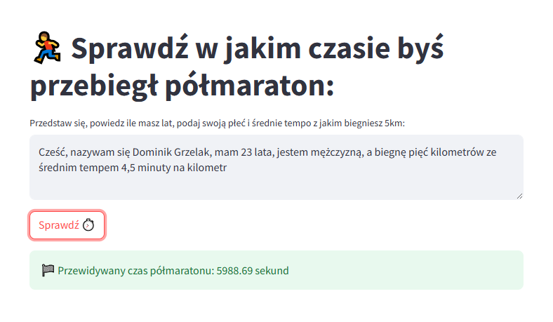

## 🏃‍♂️ Model predykcyjny dla półmaratonu

Projekt demonstracyjny łącząecy klasyczne modele Machine Learning z Large Language Models (LLM) i nowoczsnym deploymentem w chmurze.

### 🎯 Cel
Stworzenie aplikacji, która na podstawie swobodnego opisu użytkownika (wiek, płeć, tempo biegu) potrafi przewidzieć jego poziom wytrenowania i czas w jakim przebiegnie półmaraton.

---

### 🧪 Pipeline modelu ML
- Pobieranie surowych danych z **Digital Ocean Spaces** (obiektowy storage),
- Czyszczenie i przygotowanie danych (`pandas`, `sklearn`),
- **Feature engineering** i selekcja cech,
- Trenowanie modelu predykcyjnego (Gradient Boosting Regressor),
- Zapis wytrenowanego modelu lokalnie oraz do **Digital Ocean Spaces**.

---

### 🖥️ Aplikacja Streamlit
- Użytkownik wpisuje opis w stylu:  
  `"Cześć, mam na imię Basia, jestem 28-letnią kobietą, biegam 5 km w 22 minuty"`  
- Z pomocą **OpenAI GPT-4o** wyciągane są wyciągane dane (`wiek`, `płeć`, `tempo`) jako `JSON`,
- Walidacja: jeśli brakuje informacji, użytkownik dostaje komunikat, co jeszcze musi podać,
- Na podstawie przetworzonych danych uruchamiany jest wytrenowany model,
- Aplikacja wdrożona na **Digital Ocean App Platform**,
- Integracja z **Langfuse** – monitoring skuteczności działania LLM (prompt metrics & tracing).

---

### 🛠️ Stack technologiczny
- `Python`, `scikit-learn`, `Streamlit`, `OpenAI`, `Langfuse`
- `Digital Ocean Spaces`, `boto3`
- `pandas`, `json`, `dotenv`

---

📦 Repozytorium: [GitHub – Projekt ML + LLM + Streamlit](https://github.com/JestemDominik/monitorowany_model)  
🌐 Demo: [Zobacz działającą aplikację](https://lionfish-app-akrmi.ondigitalocean.app/)
