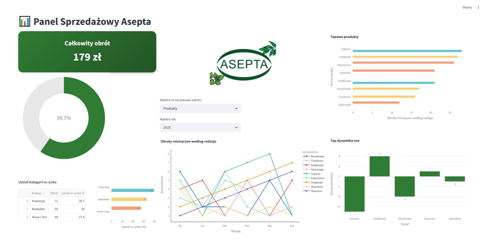
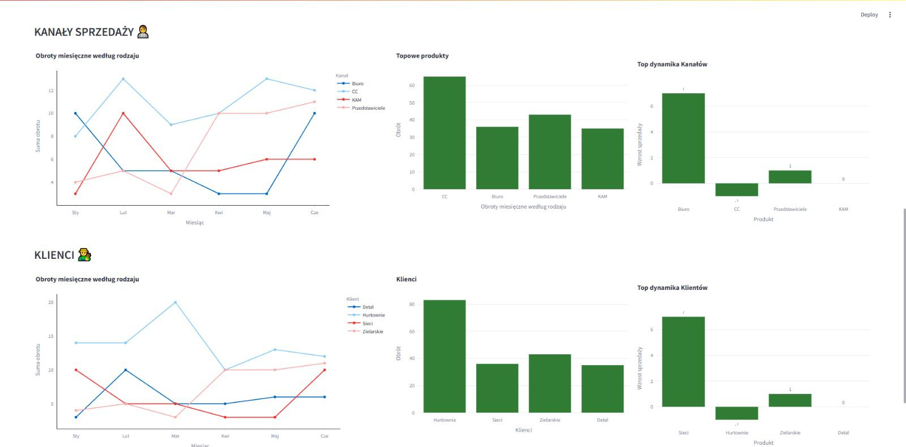

# 📊 Panel sprzedażowy dla działu sprzedaży

Stworzyłem interaktywny panel sprzedażowy w Streamlit połączony z Google Sheets, który pozwoli zespołowi monitorować kluczowe metryki w czasie rzeczywistym.

### Funkcje:

- analiza celów sprzedażowych,

- różne typy wykresów z możliwościami filtorwania,

- Podział na różne kanały sprzedażowe

- wersje interfejsu dla handlowców i managementu.

Dzięki tej aplikacji zespół będzie mógł szybciej reagować na wyniki i lepiej zarządzać priorytetami sprzedażowymi. Aplikacja jest w trakcie budowy.

Kod: [Repozytorium Github](https://github.com/JestemDominik/Panel-sprzeda-owy)  

