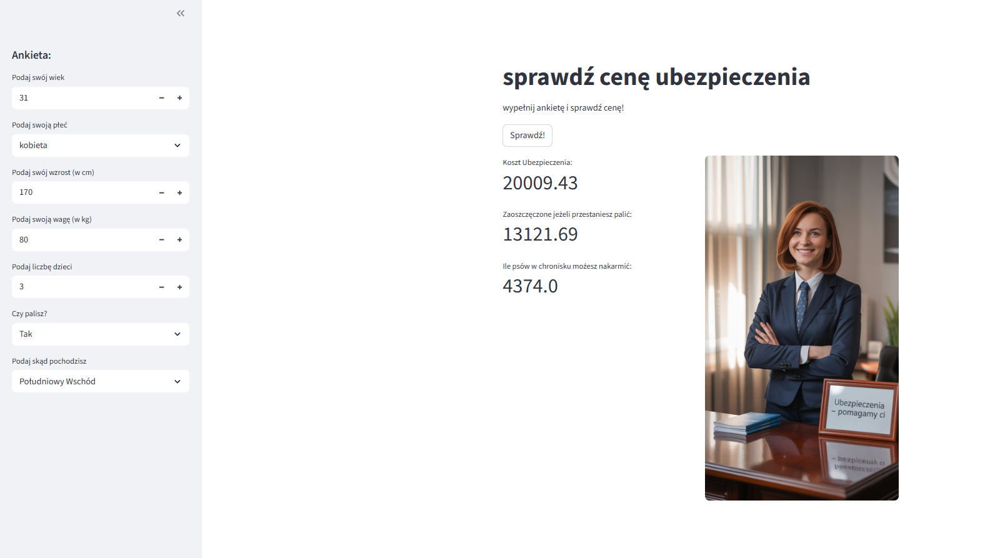

#  Insurance Cost Prediction App

Aplikacja webowa stworzona w Streamlit, która przewiduje roczny koszt ubezpieczenia zdrowotnego na podstawie danych demograficznych użytkownika (wiek, płeć, BMI, liczba dzieci, palenie, region). Model uczenia maszynowego (Gradient Boosting Regressor) został wytrenowany na publicznym zbiorze danych Insurance Dataset.

🔍 Użytkownik może wprowadzić dane w formularzu, a aplikacja:
- natychmiast pokazuje przewidywany koszt ubezpieczenia,
- oblicza potencjalne oszczędności, jeśli użytkownik jest palaczem,
- dynamicznie przelicza BMI.

🧠 Model wybrano na podstawie testów z użyciem PyCaret oraz Scikit Learn oraz dostrojono za pomocą GridSearchCV i porównano za pomocą MLflow
📈 MAE modelu na zbiorze testowym: ~2700

<a href="https://github.com/JestemDominik/Przewidywanie_ubezpiecze-" class="md-button md-button--primary">
    Zobacz na GitHubie
</a>

<a href="Model_Analysis.ipynb" class="md-button md-button--primary">Pobierz Notebook</a>

<iframe
    id="content"
    src="Analysis.html"
    width="100%"
    style="border:1px solid black;overflow:hidden;"
></iframe>
